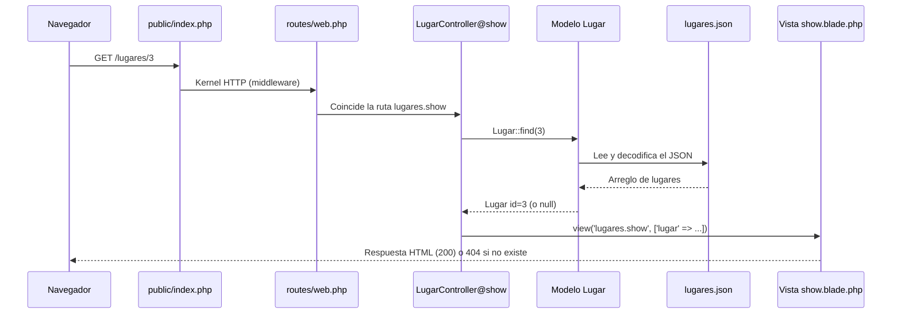

# Catálogo Turístico de El Salvador — Patrón MVC en Laravel

Aplicación web simple que muestra lugares turísticos de El Salvador usando **archivos JSON** como fuente de datos. Su objetivo es demostrar el patrón **Modelo–Vista–Controlador (MVC)** y el ciclo de vida de una petición HTTP en Laravel.

## Funcionalidades

- Listar lugares turísticos desde `database/data/lugares.json` (con filtros por departamento y categoría).
- Ver el detalle de un lugar: título, departamento, categoría, precios, horario, actividades, etc.
- Enviar un formulario de contacto (se guarda en `database/data/contactos.json`).

## Requisitos

- PHP 8.2 o superior
- Composer
- Git

## Instalación

```bash
git clone https://github.com/TU_USUARIO/turismo-sv.git
cd turismo-sv
composer install
cp .env.example .env
php artisan key:generate
```

> Si aparece un error de sesiones o base de datos, en `.env` usa `SESSION_DRIVER=file` y `CACHE_STORE=file`. La aplicación **no necesita base de datos**.

Iniciar el servidor:

```bash
php artisan serve
```

Abrir <http://127.0.0.1:8000>.

## Estructura relevante

| Capa / Elemento | Archivo |
|---|---|
| Rutas | `routes/web.php` |
| Controlador (lugares) | `app/Http/Controllers/LugarController.php` |
| Controlador (contacto) | `app/Http/Controllers/ContactoController.php` |
| Modelo (lugares) | `app/Models/Lugar.php` |
| Modelo (contactos) | `app/Models/Contacto.php` |
| Vistas | `resources/views/` (`layouts`, `lugares`, `contacto`) |
| Datos de prueba | `database/data/lugares.json`, `database/data/contactos.json` |

## Rutas

| Método | URL | Controlador@método | Descripción |
|---|---|---|---|
| GET | `/` | redirect | Redirige a `/lugares` |
| GET | `/lugares` | `LugarController@index` | Lista de lugares |
| GET | `/lugares/{id}` | `LugarController@show` | Detalle de un lugar |
| GET | `/contacto` | `ContactoController@create` | Formulario |
| POST | `/contacto` | `ContactoController@store` | Guarda el mensaje |

## Flujo MVC implementado

Ejemplo: el usuario abre `GET /lugares/3`.



1. **Petición:** el navegador envía `GET /lugares/3` y llega al *front controller* `public/index.php`.
2. **Enrutamiento:** Laravel arranca, pasa la petición por los middleware y `routes/web.php` la asocia con `LugarController@show`, capturando `id = 3`.
3. **Controlador:** recibe el `id`, no accede a los datos por sí mismo: se los pide al modelo.
4. **Modelo:** `Lugar::find(3)` lee `database/data/lugares.json`, lo decodifica con `json_decode` y devuelve el lugar (o `null`).
5. **Decisión:** si el lugar no existe, el controlador ejecuta `abort(404)`; si existe, envía los datos a la vista.
6. **Vista:** `show.blade.php` recibe `$lugar` y genera el HTML con Blade.
7. **Respuesta:** Laravel devuelve la respuesta HTTP al navegador.

**Flujo del formulario de contacto (POST):** `POST /contacto` → middleware CSRF → `ContactoController@store` → validación (`$request->validate`) → `Contacto::guardar()` escribe en `contactos.json` → redirección con mensaje flash → vista del formulario.

## Capturas de pantalla

| Listado | Detalle | Contacto |
|---|---|---|
|  |  |  |

## Autor

Tu nombre — Materia / Universidad — 2026
